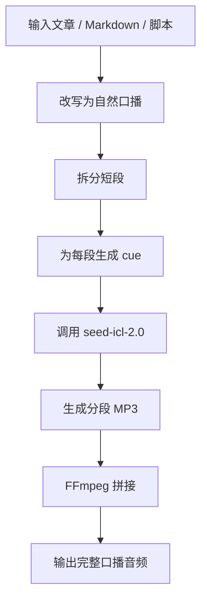
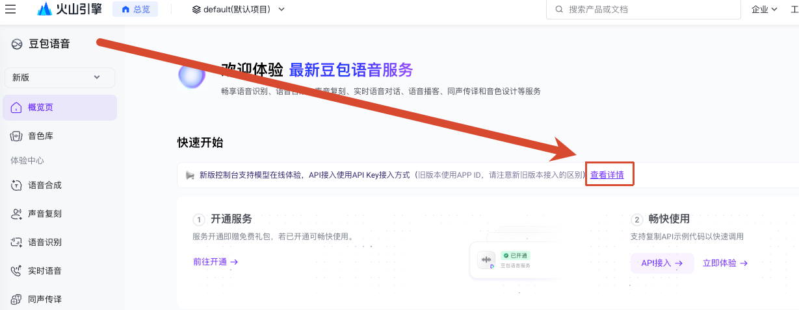
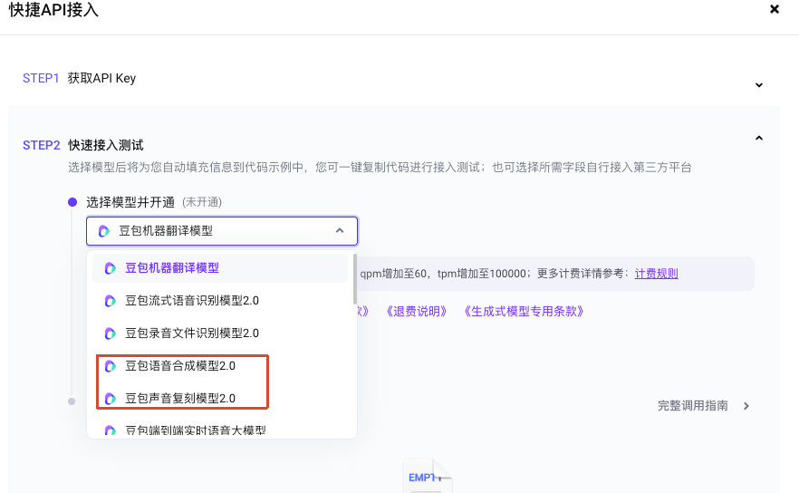
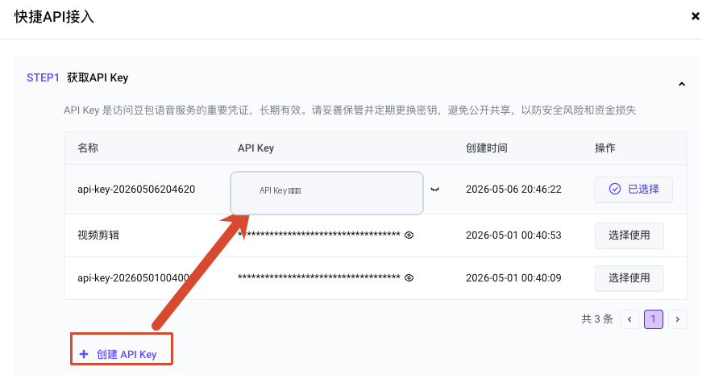
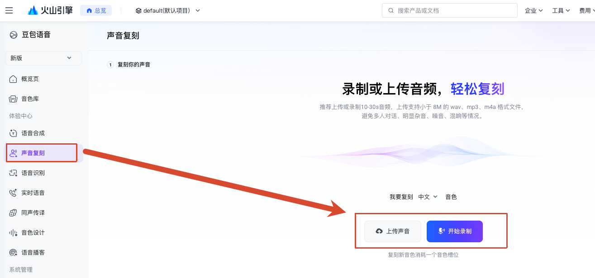
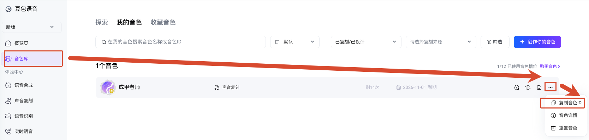

# Volcengine Cloned Voice TTS

> 面向中文长文口播的 Codex Skill。
> 用户在火山引擎控制台完成声音复刻并提供音色 ID，Agent 负责口语化改写、逐段情绪提示、调用豆包语音合成模型 2.0 生成完整 MP3。

项目定位 · 功能特性 · 工作流 · 快速开始 · 火山引擎配置 · 使用流程 · 项目结构 · 常见问题

## 项目定位

`volcengine-cloned-voice-tts` 不是一个声音复刻训练工具，而是一个“复刻音色口播生成”Skill。

它假设用户已经在火山引擎控制台完成声音复刻，并拿到了可用的 `speaker_id`。Skill 的职责是把文章、Markdown、视频稿、课程稿等长文本处理成更自然的口播分段，再用火山引擎 / 豆包语音合成模型 2.0 生成带指定音色和语气提示的音频。

## 功能特性

| 模块 | 能力 | 主要产物 |
| --- | --- | --- |
| 文本口语化 | 将书面稿改写成更适合朗读的短句，保留原意和结构 | 口播分段文本 |
| 情绪规划 | 为每段生成 `cue`，描述语气、节奏、重音和情绪 | `segments.json` |
| 语音合成 | 使用火山引擎 `seed-icl-2.0` 和用户提供的 `speaker_id` 合成 MP3 | 分段 MP3 |
| 音频拼接 | 使用 FFmpeg 拼接所有分段 | 完整 narration MP3 |
| 断点续跑 | 已生成的分段可跳过，失败后可继续 | 可恢复工作目录 |

## 工作流



## 快速开始

### 1. 准备环境变量

设置火山引擎 API Key：

```bash
export VOLCENGINE_API_KEY="你的 API Key"
```

API Key 是长期有效凭证，只应保存在本地环境变量或本地 `.env`，不要提交到 Git 或公开文档。

### 2. 准备音色 ID

从火山引擎控制台复制已复刻音色的音色 ID，通常形如：

```text
S_xxxxxxxx
```

这个值在脚本里作为 `--speaker` 传入。

### 3. 准备分段文件

创建 `segments.json`：

```json
[
  {
    "cue": "平静开场，真诚",
    "text": "这几年，我一直在实践复利人生这个想法。慢慢地，我发现，自己的心境真的和过去不一样了。"
  },
  {
    "cue": "稍微加重，带一点回忆感",
    "text": "以前我没有这种认识的时候，总觉得事情永远忙不完。"
  }
]
```

### 4. 运行合成

```bash
python3 /Users/links/.codex/skills/volcengine-cloned-voice-tts/scripts/volc_narrate.py \
  --segments /path/to/segments.json \
  --speaker S_yourSpeakerId \
  --output /tmp/narration.mp3
```

可选参数：

```bash
--speech-rate -2
--work-dir /tmp/narration_segments
--resume
--retries 3
```

## 火山引擎配置

### 开通模型能力

1. 打开火山引擎豆包语音服务控制台：

```text
https://console.volcengine.com/speech/new/overview
```

2. 在总览页的“快速开始”区域，点击提示条里的“查看详情”，进入“快捷 API 接入”面板。



3. 在 `STEP2 快速接入测试` 中打开“选择模型并开通”，选择并开通：

- `豆包语音合成模型2.0`
- `豆包声音复刻模型2.0`



4. 回到 `STEP1 获取API Key`，创建 API Key 或点击已有 Key 的“选择使用”。



5. 把选中的 API Key 配置到本地环境变量：

```bash
export VOLCENGINE_API_KEY="你的 API Key"
```

### 创建声音复刻音色

1. 进入左侧菜单 `声音复刻`。
2. 选择中文和音色类型。
3. 上传音频或直接录制。

建议音频时长 10-30 秒，格式可用 wav、mp3、m4a，文件小于 8MB。尽量使用单人、清晰、无明显噪声和混响的声音。



### 获取音色 ID

1. 进入左侧菜单 `音色库`。
2. 切到 `我的音色`。
3. 找到目标音色，点击右侧三点菜单。
4. 选择“复制音色ID”。

复制出来的值就是运行脚本时传入的 `--speaker`。



## 使用流程

### 在 Agent 中使用

用户可以直接说：

```text
使用火山复刻音色 S_xxxxxxxx，把这篇文章念成自然口播，并适当加入情绪。
```

Agent 应当：

1. 将原文改写成自然口播。
2. 拆成适合合成的短段。
3. 为每段写 `cue`。
4. 生成 `segments.json`。
5. 调用 `scripts/volc_narrate.py`。
6. 返回最终 MP3 路径和分段文件路径。

### 命令行使用

如果已经有 `segments.json`，可直接运行脚本：

```bash
python3 /Users/links/.codex/skills/volcengine-cloned-voice-tts/scripts/volc_narrate.py \
  --segments /tmp/segments.json \
  --speaker S_xxxxxxxx \
  --output /tmp/narration.mp3 \
  --work-dir /tmp/narration_segments \
  --resume
```

## 合成接口

生成声音使用火山引擎 TTS v3 单向接口：

```text
https://openspeech.bytedance.com/api/v3/tts/unidirectional
```

关键参数：

| 字段 | 值 |
| --- | --- |
| `X-Api-Resource-Id` | `seed-icl-2.0` |
| `req_params.speaker` | 用户提供的 `speaker_id` |
| `req_params.model` | `seed-tts-2.0-expressive` |
| `req_params.additions` | JSON 字符串，启用 `use_tag_parser` |

脚本会把每段包装成：

```xml
<cot text=语气提示>口播文本</cot>
```

并发送 `use_tag_parser=true`，让模型按 `cue` 控制语气。

## 项目结构

```text
volcengine-cloned-voice-tts/
├── SKILL.md
├── README.md
├── image/
│   ├── 01.png
│   ├── 02.png
│   ├── 03.png
│   ├── 04.png
│   └── 05.png
├── references/
│   └── volcengine_api.md
└── scripts/
    └── volc_narrate.py
```

## 常见问题

### 这个 Skill 会直接复刻声音吗？

不会。声音复刻在火山引擎控制台完成。这个 Skill 只使用已经复刻好的音色 ID 进行合成。

### `speaker_id` 在哪里拿？

在火山引擎控制台进入 `音色库 > 我的音色`，点击目标音色右侧三点菜单，选择“复制音色ID”。

### 如何控制情绪？

在 `segments.json` 的 `cue` 字段里描述“怎么说”，例如：

- `平静开场，真诚`
- `稍微加重，带一点回忆感`
- `像课堂解释，节奏放慢`
- `引用名言，稳重`
- `关键提醒，加重`
- `结尾，温暖有希望`

不要在 `cue` 里复述正文内容。

### 出现 `resource ID is mismatched with speaker related resource` 怎么办？

通常表示该 `speaker_id` 不属于当前 API Key 绑定的账号/资源，或没有对应模型权限。请确认 API Key、控制台项目和音色 ID 来自同一个火山账号与项目。

### 出现 `additions of type string` 报错怎么办？

`req_params.additions` 必须是 JSON 字符串，而不是对象。脚本已经内置正确处理；如果手写请求，请确保使用字符串形式：

```json
"additions": "{\"disable_default_bit_rate\": true, \"use_tag_parser\": true}"
```

## 安全与隐私

- 不要把 API Key 写进 `README.md`、`SKILL.md`、Git 提交或公开聊天记录。
- 不要把未经授权的声音样本用于复刻。
- 处理敏感文稿时，确认输出目录和中间分段音频不会被同步到公开网盘或代码仓库。
- `segments.json` 会包含完整文稿内容，分享前请检查是否包含隐私信息。
